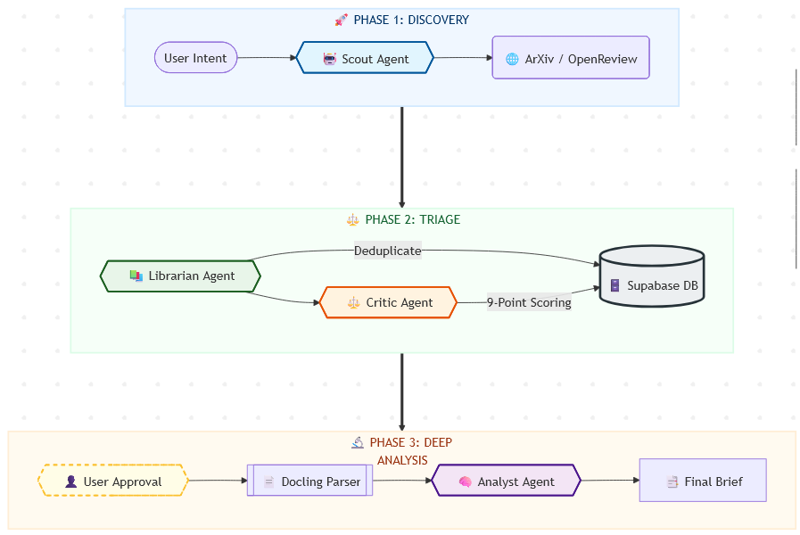
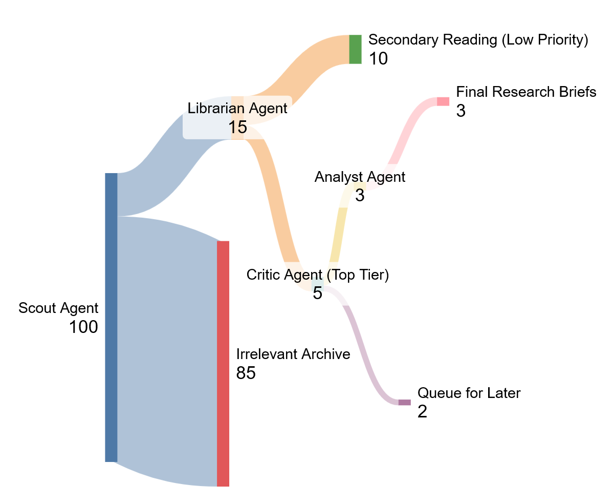

# VLA-RA: Vision-Language-Action Research Assistant

This project is a LangGraph-based framework for retrieving, parsing, and evaluating papers and code repositories based on a deterministic weighted rubric.

## Overview: The Agentic Workflow

At the core of the VLA-RA is an autonomous, goal-oriented agentic workflow powered by **DeepSeek V3** via **OpenRouter**. The system involves multiple dedicated, specialized agents (nodes) collaborating in a cyclic or sequential graph to transform a user's initial high-level intent into highly actionable insights. The workflow typically progresses from broad discovery to deep qualitative analysis.



## The Paper Funnel

VLA-RA functions similarly to a highly selective funnel. Given the immense volume of daily research, the framework uses successive processing stages to drastically narrow down the candidate artifacts:

1. **Broad Discovery**: The Scout retrieves a large batch of potentially relevant resources.
2. **Filtering & Organization**: The Librarian structures raw data into manageable units.
3. **Rigorous Evaluation**: The Critic scores candidates against deterministic, domain-specific rubrics. The vast majority of resources fall away at this stage.
4. **Deep Dive Analysis**: The Multimodal Analyst parses complex formats (e.g., dense PDFs) and provides extensive semantic exploration only on the highest-scoring assets.



## Project Structure and Important Files

The codebase adheres strictly to SOLID principles, carefully separating agent intelligence from strict scoring logic and foundational tools.

### Main Execution
- `main.py`: The entry point for execution. It parses args, initialises the local database, triggers graph execution, and emits logs.

### Application Logic (`chains/` & `core/`)
- `chains/graph.py`: Defines the LangGraph orchestration, connecting Nodes (agents) and defining conditional transitions based on intermediate states.
- `chains/state.py`: Defines the `GraphState` shared between agent graph nodes.
- `core/scoring_logic.py`: Contains deeply deterministic mathematical scoring algorithms for calculating paper scores deterministically, keeping node logic separate.
- `core/config.py`: General system config definitions, including LLM configuration schemas and batch parameters.
- `core/database.py`: Interface for local SQLite persistence (`data/vla_ra.db`), used to save research scores and milestones dynamically.

### Agents (`agents/`)
- `agents/scout.py`: Connects with the ArXiv API using intent-based semantic search with DeepSeek V3 via OpenRouter to intelligently scope query candidates.
- `agents/librarian.py`: Standardizes and logs the pipeline's raw data queue from the Scout node ensuring pipeline integrity. Checks the local database to avoid duplicate processing.
- `agents/critic.py`: Validates and scores papers securely against standard mathematical scoring criteria using inputs shaped by LLMs or heuristics.
- `agents/analyst.py`: An advanced analytical agent designed for deep-diving into long-context tasks such as PDF parsing and architecture reviews via LangGraph state changes.

### External Tool Integrations (`tools/`)
- `tools/arxiv_api.py`: Robust wrappers for querying and interacting directly with external ArXiv publication logic.
- `tools/code_interpreter.py`: Advanced interpreter configuration to process code execution alongside theoretical insights from repositories.
- `tools/parser.py`: Implements advanced PDF parsing mechanics (e.g., Docling API bridging) to yield high-fidelity visual/textual data for multimodal models.

## "Must-Read" Rubric Documentation
*To be defined: A weighted scoring logic applied by the `critic` node.*

## Quickstart

This project uses `uv` as the package manager.

1. Ensure `uv` is installed.
2. Install dependencies:
   ```bash
   uv sync
   ```
3. Set your environment variables in `.env`:
   ```
   OPENROUTER_API_KEY="your-openrouter-key"
   ```
   The local SQLite database (`data/vla_ra.db`) is created automatically on first run — no external database setup required.
4. Run the workflow:
   ```bash
   uv run main.py
   ```
